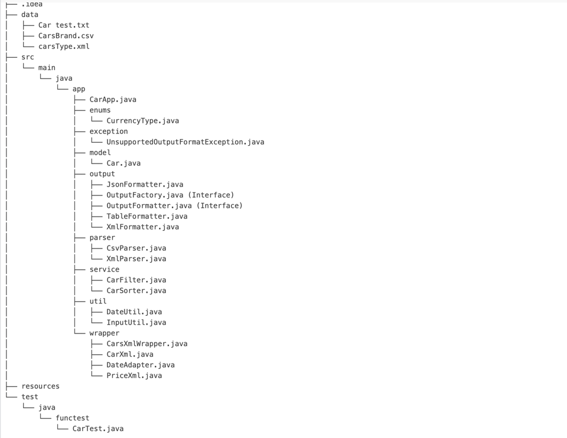

# 🚗 Car Data Processing App

A Java console application to parse, filter, sort, and output car data from XML and CSV sources in various formats like table, JSON, or XML.

---

## 📁 Project Structure


## ▶️ How to Run

### Option 1: Run via IDE (IntelliJ)

1. Open the project in your IDE.
2. Run the `CarApp.java` class.
3. Follow console prompts to choose filter/sort/output format.

### Option 2: Run via Command Line

Make sure you're in the root directory and using Java 8+.

```bash
cd /target
java -jar coding_test-1.0-SNAPSHOT.jar
